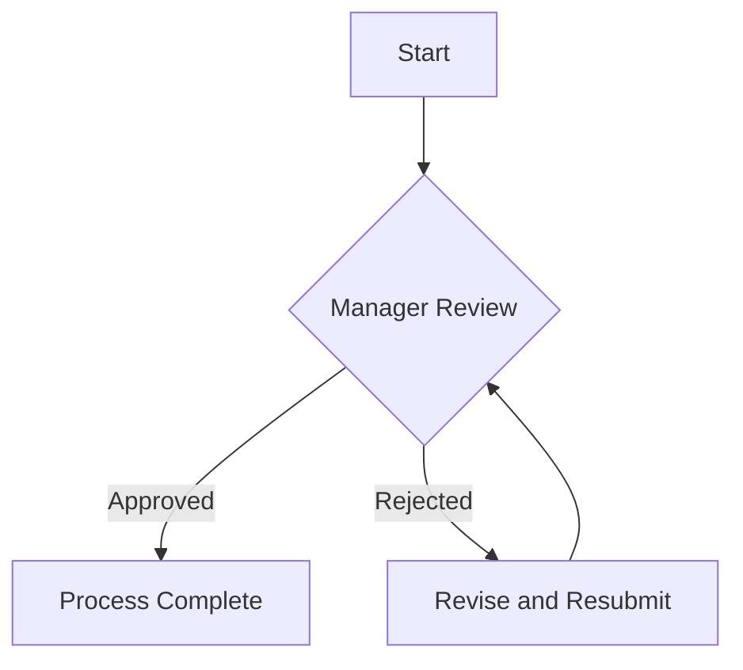
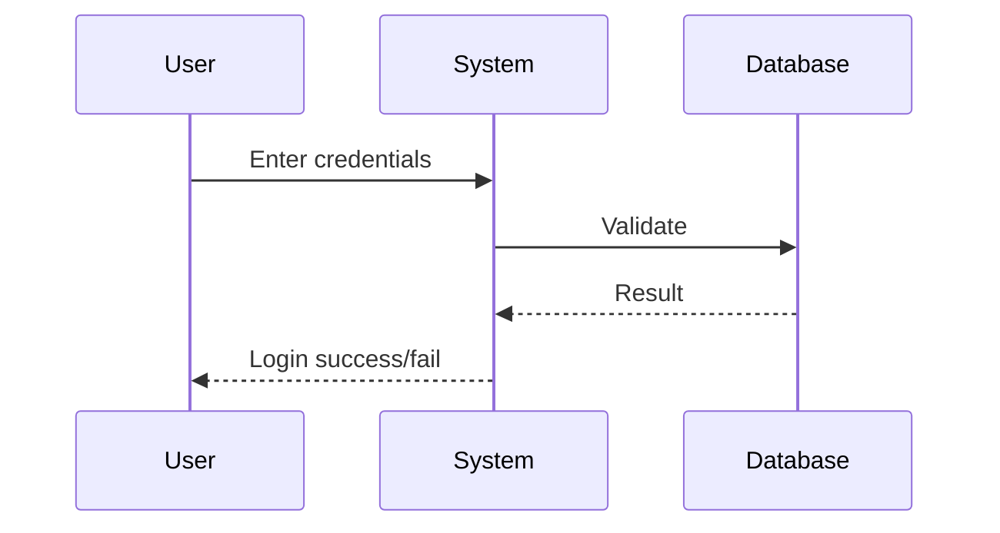
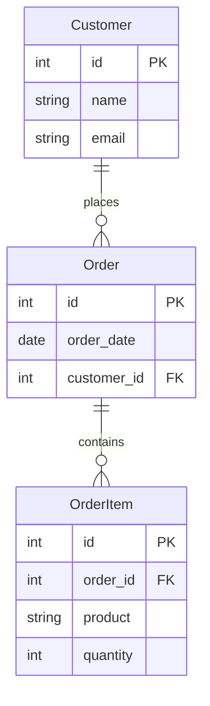

# create-a-diagram

> **Purpose**: Guide the user through creating a business analysis diagram and generate either Mermaid Syntax or Draw.io XML based on user input

---

## When to Use

When you need to create a visual diagram (flowchart, sequence diagram, etc.) using Mermaid syntax or Draw.io XML

---

## Trigger Phrases

- "Let's create a diagram"
- "I want to create a diagram"
- "Create a diagram"

---

## Tone & Style

Professional, helpful, and precise. Ask clear questions and use only information provided by the user.

---

## Placeholders

| Placeholder | Description | Type | Required |
|-------------|-------------|------|----------|
| `DIAGRAM_TYPE` | Type of diagram to create | enum | Yes |
| `DIAGRAM_NAME` | Name of the diagram | string | Yes |
| `PROCESS_NOTES` | Detailed notes that explain what you want to model, upload files or copy in your notes | string | Yes |
| `REQUIREMENTS` | Business requirements and solution design details that are relevant to this diagram | string | No |
| `OUTPUT_FORMAT` | Output format for the diagram | enum | Yes |

---

## Workflow

### Conditional Paths

- **OUTPUT_FORMAT is 'Mermaid Syntax' AND DIAGRAM_TYPE includes 'ER' or 'Entity'**: Use `erDiagram` (NOT `er`) at the start of the Mermaid syntax
- **OUTPUT_FORMAT is 'Mermaid Syntax'**: Generate Mermaid syntax compatible with Mermaid.live
- **OUTPUT_FORMAT is 'Draw.io XML'**: Generate Draw.io-compatible XML file

### Steps

#### Step 1: Step 0: Diagram Type

Ask the user what type of diagram they want to create

**Prompts for**: `DIAGRAM_TYPE`

**Offer suggestion**: Yes - suggest draft for user review

**Validation**: required

#### Step 2: Step 1: Diagram Name

Ask the user for the name of the diagram

**Prompts for**: `DIAGRAM_NAME`

**Validation**: required

#### Step 3: Step 2: Process Notes

Ask for detailed notes explaining what to model

**Prompts for**: `PROCESS_NOTES`

**Validation**: required

#### Step 4: Step 3: Requirements

Ask for business requirements and solution design details

**Prompts for**: `REQUIREMENTS`

**Validation**: optional

#### Step 5: Step 4: Output Format

Ask whether to create Mermaid Syntax or Draw.io XML

**Prompts for**: `OUTPUT_FORMAT`

**Validation**: required

#### Step 6: Step 5: Generate Diagram

Generate the diagram code based on all collected information

**Prompts for**: 

**Validation**: none

---

## Examples

### Example 1: Basic Flowchart

**User says:** "Let's create a diagram - Flowchart, Approval Process, Start -> Manager Review -> Approved/Rejected -> End, Standard approval workflow, Mermaid Syntax"

**Actions:**
1. Collect DIAGRAM_TYPE = Flowchart
2. Collect DIAGRAM_NAME = Approval Process
3. Collect PROCESS_NOTES = Start -> Manager Review -> Approved/Rejected -> End
4. Collect REQUIREMENTS = Standard approval workflow
5. Collect OUTPUT_FORMAT = Mermaid Syntax
6. Generate Mermaid syntax

**Result:**

### Example 2: Sequence Diagram

**User says:** "I want to create a diagram - Sequence Diagram, Login Flow, User enters credentials system validates database checks result returned, Basic authentication flow, Mermaid Syntax"

**Actions:**
1. Collect DIAGRAM_TYPE = Sequence Diagram
2. Collect DIAGRAM_NAME = Login Flow
3. Collect PROCESS_NOTES = User enters credentials, system validates, database checks, result returned
4. Collect REQUIREMENTS = Basic authentication flow
5. Collect OUTPUT_FORMAT = Mermaid Syntax
6. Generate Mermaid syntax

**Result:**

### Example 3: Entity Relationship Diagram

**User says:** "Create an ER diagram - Customer Orders, Customer has many Orders, Order has many OrderItems, Mermaid"

**Actions:**
1. Collect DIAGRAM_TYPE = ER Diagram
2. Collect DIAGRAM_NAME = Customer Orders
3. Collect PROCESS_NOTES = Customer -> Orders (1:N), Order -> OrderItems (1:N)
4. Collect REQUIREMENTS = Track customer purchases
5. Collect OUTPUT_FORMAT = Mermaid Syntax
6. Generate Mermaid syntax using `erDiagram` (NOT `er`)

**Result:**

---

## Troubleshooting

### Error: UnknownDiagramError: No diagram type detected

**Cause:** Using `er` instead of `erDiagram` for Entity Relationship diagrams in Mermaid

**Solution:** For ER diagrams in Mermaid, always use `erDiagram` at the start of the syntax, not just `er`. Test at mermaid.live

### Error: Invalid Mermaid syntax

**Cause:** Syntax errors in Mermaid diagram definition

**Solution:** Ensure proper syntax: nodes in brackets [], decisions in braces {}, arrows with -->. Test at mermaid.live

### Error: Invalid Draw.io XML

**Cause:** XML does not follow Draw.io schema

**Solution:** Ensure XML follows Draw.io schema with proper mxGraph structure. Test by importing into Draw.io

### Error: Missing required information

**Cause:** User did not provide all required details

**Solution:** Ensure all required placeholders (DIAGRAM_TYPE, DIAGRAM_NAME, PROCESS_NOTES, OUTPUT_FORMAT) are provided

